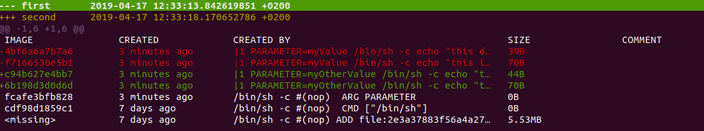

Run the following:

* docker build --build-arg="PARAMETER=myValue" -t first .
* docker build --build-arg="PARAMETER=myOtherValue" -t second .

We have already seen during execution that the layer, that we know is independent from the ARG is actually being rebuild.
Compare layers:

* docker history first > first
* docker history second > second
* diff -u first second | tig

Also there is a snapshot of the result: 
We can see that the first three layers (from bottom to top) are identical. Every following (RUN) layer get the parameter provided and thus differs if the ARG differs.


This is often (not ideally) used for proxy configuration:
```Dockerfile
FROM alpine
ARG http_proxy
RUN sudo apt-get update
RUN sudo apt-get -y install my-package
...
```
A proxy ARG will then affect all the following RUN layers and your image is not comparable depending on where it is built.
See [../proxy](../proxy) how that can be solved better.