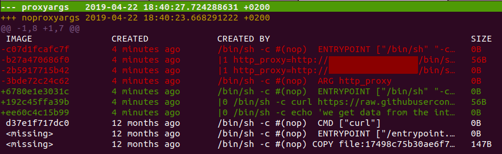

## Docker and proxy


### Adding proxy settings to ~/.docker/config.json

See: https://docs.docker.com/network/proxy

This will affect all running containers by setting the following environment variables: 
```
http_proxy
https_proxy
no_proxy
HTTP_PROXY
HTTPS_PROXY
NO_PROXY
```
*That means it will affect the build time of images as well as running containers!*
Run the following behind a proxy _with_ and _without_ the applied proxy settings above:
`docker run -it appropriate/curl --max-time 10 --connect-timeout 10 https://raw.githubusercontent.com/xellsys/references/master/README.md`

##### Without:
```
$ docker run -it appropriate/curl --max-time 10 --connect-timeout 10 https://raw.githubusercontent.com/xellsys/references/master/README.md
curl: (28) Connection timed out after 10001 milliseconds
```

##### With:
```
$ docker run -it appropriate/curl --max-time 10 --connect-timeout 10 https://raw.githubusercontent.com/xellsys/references/master/README.md
# references
a place for some reference implementations
```

The great with this setting is that it is independent from the image.
During the image build process the proxy is propagated as well.
Compare the two Dockerfiles: Dockerfile.proxy-args and Dockerfile.no-proxy-args.
For simplicity reasons I limited it to the http_proxy var, but in reality you probably need http_proxy, https_proxy, no_proxy, HTTP_PROXY, HTTPS_PROXY, NO_PROXY. 
The downside of the method with proxy ARGs is that it affects your image layers.

Run:

`docker build --no-cache -f Dockerfile.no-proxy-args -t noproxyargs .`

and

`docker build --no-cache -f Dockerfile.proxy-args -t proxyargs .`

Then compare the images:

`docker history noproxyargs > noproxyargs`

`docker history proxyargs > proxyargs`

`diff -u proxyargs noproxyargs | tig`

Basically the result will be like the following:



For further reference take a look at the sample snippet in [../build-arg-effect](../build-arg-effect).


### Adding proxy settings to /etc/systemd/system/docker.service.d/http-proxy.conf

See: https://docs.docker.com/config/daemon/systemd/#httphttps-proxy

This will affect your local development: *pulling and pushing images from/to dockerhub through a proxy.*
Run the following behind a proxy _with_ and _without_ the applied proxy settings above:
`docker pull alpine`
##### Without:
```
$ docker pull alpine
Using default tag: latest
Error response from daemon: Get https://registry-1.docker.io/v2/: net/http: request canceled while waiting for connection (Client.Timeout exceeded while awaiting headers)
```

##### With:
```
$ docker pull alpine
Using default tag: latest
latest: Pulling from library/alpine
Digest: sha256:28ef97b8686a0b5399129e9b763d5b7e5ff03576aa5580d6f4182a49c5fe1913
Status: Image is up to date for alpine:latest
```


Bottom line: It makes sense to use both settings to properly work with docker behind a proxy.